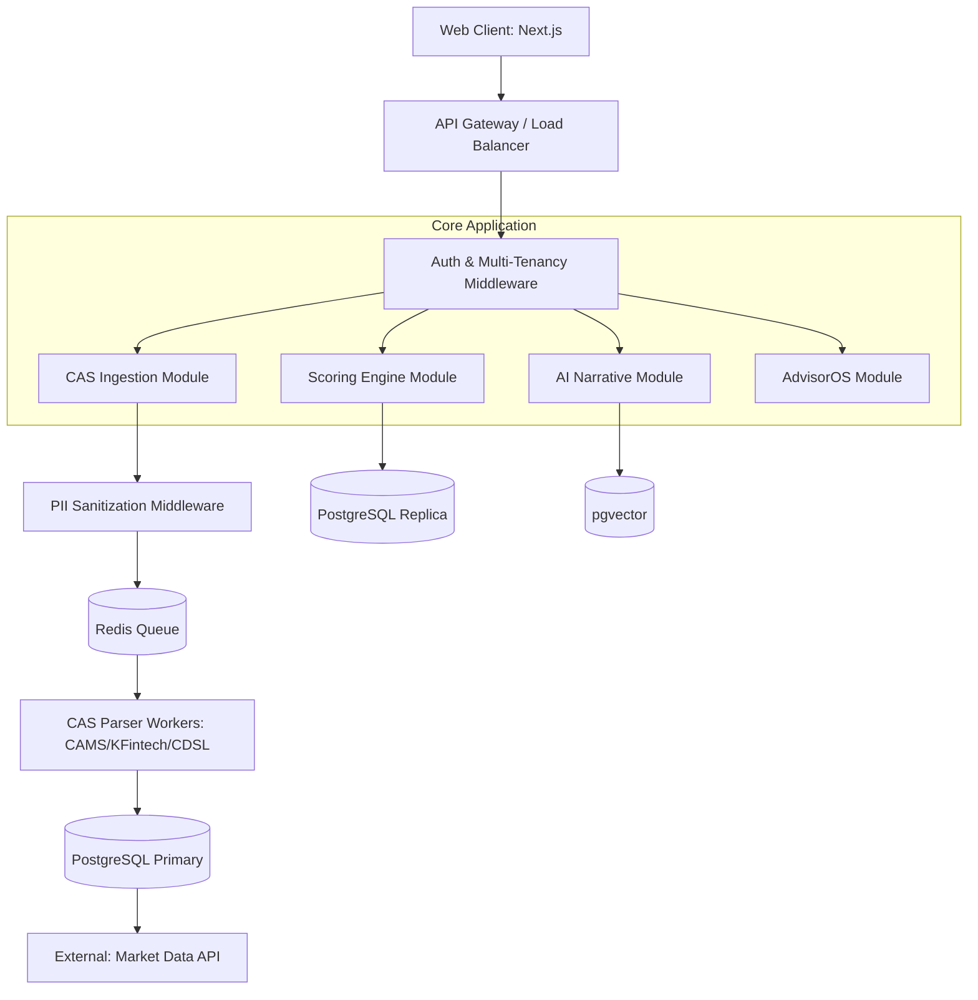

# SPEC-01-03: System Architecture

## 1. Context & Background
This document defines the foundational architectural blueprint for **INIVESTEC**, designed to handle secure CAS ingestion, complex financial scoring, and AI narrative generation while maintaining strict DPDP compliance.

## 2. Architectural Style
**Modular Monolith** (Phase 1-4), evolving into **Domain-Driven Microservices** (Phase 5+). This approach minimizes initial DevOps overhead while enforcing strict module boundaries (e.g., the `scoring` module cannot directly query the `cas_parser` database tables; it must use defined interfaces).

## 3. High-Level System Diagram

## 4. Component Responsibilities
- **PII Sanitization Middleware**: Intercepts all incoming CAS payloads. Masks names, PAN, and contact info *before* persistence or LLM processing (Critical for SPEC-04-03).
- **Scoring Engine**: Stateless compute module that fetches normalized holdings and applies Z-score normalization and 5-Pillar logic (SPEC-03-01, SPEC-03-02).
- **AI Narrative Module**: Orchestrates PydanticAI agents to generate structured, hallucination-free portfolio insights (SPEC-05-02).

## 5. Non-Functional Requirements
- **Availability**: 99.9% uptime for API Gateway and Auth.
- **Scalability**: Parser workers must scale horizontally via Redis Queue to handle batch CAS uploads.
- **Security**: All data in transit encrypted via TLS 1.3; data at rest encrypted via AES-256.
