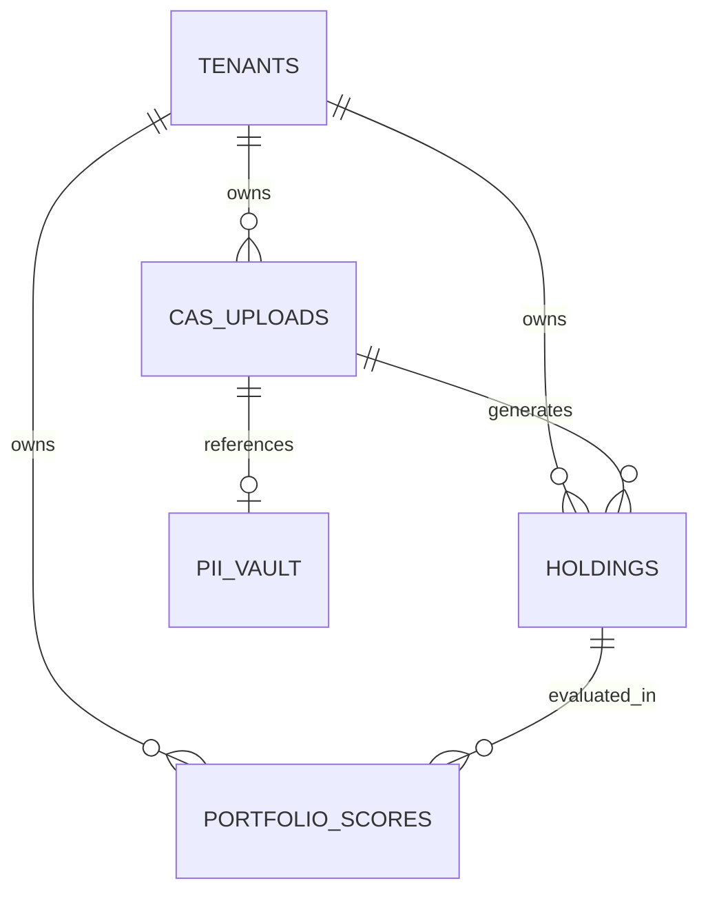

# SPEC-01-04: Database Schema

## 1. Context & Background
Defines the foundational PostgreSQL schema for **INIVESTEC**. The schema is designed to support multi-tenancy, strict PII segregation (DPDP compliance), and the complex relational data required for 5-Pillar portfolio scoring.

## 2. Design Principles
- **Multi-Tenancy**: Every core table MUST include a `tenant_id` (UUID) with Row-Level Security (RLS) policies.
- **PII Segregation**: Sensitive CAS metadata is stored in a separate, heavily audited schema (`pii_vault`), isolated from analytical tables.
- **Immutability**: Financial transactions and scores are append-only. Corrections are handled via new records, not `UPDATE`s.

## 3. Core Entity Definitions
### 3.1 `tenants`
- `id` (UUID, PK)
- `name` (VARCHAR)
- `plan_tier` (ENUM: 'free', 'pro', 'enterprise')
- `created_at` (TIMESTAMPTZ)

### 3.2 `cas_uploads`
- `id` (UUID, PK)
- `tenant_id` (UUID, FK)
- `file_hash` (VARCHAR, SHA256)
- `parser_type` (ENUM: 'cams', 'kfintech', 'cdsl')
- `status` (ENUM: 'queued', 'parsing', 'sanitized', 'completed', 'failed')
- `pii_vault_ref` (UUID, Nullable, FK to pii_vault)

### 3.3 `holdings`
- `id` (UUID, PK)
- `tenant_id` (UUID, FK)
- `cas_upload_id` (UUID, FK)
- `isin` (VARCHAR, Indexed)
- `scheme_name` (VARCHAR)
- `units` (DECIMAL)
- `nav` (DECIMAL)
- `current_value` (DECIMAL)

### 3.4 `portfolio_scores`
- `id` (UUID, PK)
- `tenant_id` (UUID, FK)
- `snapshot_date` (DATE)
- `pillar_1_score` (DECIMAL) -- e.g., Risk Adjusted Return
- `pillar_2_score` (DECIMAL) -- e.g., Cost Efficiency
- `hhi_penalty` (DECIMAL) -- Herfindahl-Hirschman Index concentration penalty
- `fee_drag_penalty` (DECIMAL)
- `overall_score` (DECIMAL)

## 4. Entity Relationship Diagram

## 5. Data Lifecycle & Compliance
- **Retention**: Raw CAS files are deleted after 30 days; parsed, sanitized data is retained for 7 years (SEBI guideline alignment).
- **Right to Erasure**: A `DELETE` cascade from `tenants` must cryptographically shred associated `pii_vault` records and anonymize `holdings` data.

## 6. Open Questions
- Should `isin` master data be cached locally or fetched via external API on demand? *(Decision deferred to SPEC-02-02)*
